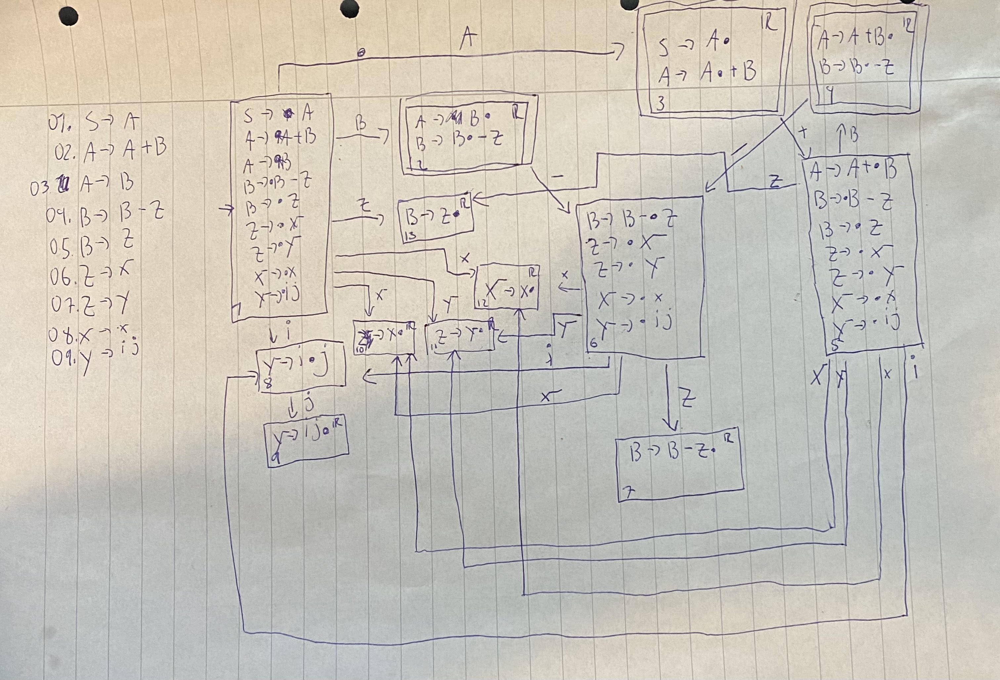

# Problem Set 3
Nicolai H. Brand

## 1
### 1.1

Given grammar:
```
A → A + B | B
B → B − Z | Z
Z → X | Y
X → x
Y → i j
```

Augmented grammar:
```
S → A       # rewritten axiom
A → A + B 
A → B
B → B − Z 
B → Z
Z → X
Z → Y
X → x
Y → i j
```

An R at the right-hand corner of a state signifies that a reduce action can be applied



### 1.2
The states with a double-outline have shift/reduce conflicts as both actions are possible.

### 1.3
Production rules with labels:
```
01 S → A
02 A → A + B 
03 A → B
04 B → B − Z 
05 B → Z
06 Z → X
07 Z → Y
08 X → x
09 Y → i j
```
I have used these labels to denote where the reduce actions go to.
(I realize this method is not perfect, but I don't have the time to redo it properly).

LR(0) table:

|    | x | i | j | - | + | $ | A | B | Z | X | Y
| -  | - | - | - | - | - | - | - | - | - | - | -
| 1  | s12  | s8 | | |   |  |  g3 | g2  | g13  | g10 |  g11 |
| 2  | r03| r03| r03| s6 / r03 |r03 |r03|   |   |   |   |   |
| 3  | s5 / a| | | | |a|   |   |   |   |   |
| 4  | r02|r02 | r02|s6 / r02| r02|r02|   |   |   |   |   |
| 5  |s12|s8 |   |   |   |   |   |   |g13|g10|g11|
| 6  |s12|s8|   |   |   |   |   |   | g7 |g10 |g11|
| 7  |r04 | r04|r04 | r04|r04 | r04 |   |   |   |   |   |
| 8  |   |   | s9|   |   |   |   |   |   |   |   |
| 9  |r09|r09|r09|r09|r09|r09  |   |   |   |   |   |
| 10 |r06|r06|r06|r06|r06|r06|   |   |   |   |   |
| 11 |r07|r07|r07|r07|r07|r07|   |   |   |   |   |
| 12 |r08|r08|r08|r08|r08|r08|   |   |   |   |   |
| 13 |r05|r05|r05|r05|r05|r05|   |   |   |   |   |


Follow sets:
```
follow(S) = { }
follow(A) = { + }
follow(B) = { + − } 
follow(Z) = { + − }
follow(X) = { + − }
follow(Y) = { + − }
```

Given the follow sets we can produce the SLR table:

|    | x | i | j | - | + | $ | A | B | Z | X | Y
| -  | - | - | - | - | - | - | - | - | - | - | -
| 1  | s12  | s8 | | |   |  |  g3 | g2  | g13  | g10 |  g11 |
| 2  | | | | s6 |r03 |r03|   |   |   |   |   |
| 3  | s5 | | | | |a|   |   |   |   |   |
| 4  | | | |s6 / r02| r02|r02|   |   |   |   |   |
| 5  |s12|s8 |   |   |   |   |   |   |g13|g10|g11|
| 6  |s12|s8|   |   |   |   |   |   | g7 |g10 |g11|
| 7  | | | | r04|r04 | r04 |   |   |   |   |   |
| 8  |   |   | s9|   |   |   |   |   |   |   |   |
| 9  | | | |r09|r09|r09  |   |   |   |   |   |
| 10 | | | ||r06|r06|   |   |   |   |   |
| 11 | | | |r07|r07|r07|   |   |   |   |   |
| 12 | | | |r08|r08|r08|   |   |   |   |   |
| 13 | | | |r05|r05|r05|   |   |   |   |   |


Here we see see there is still a conflict. This means the grammar is not SLR parseable.

## 2
See `ps3_skeleton/src/tree.c`.

